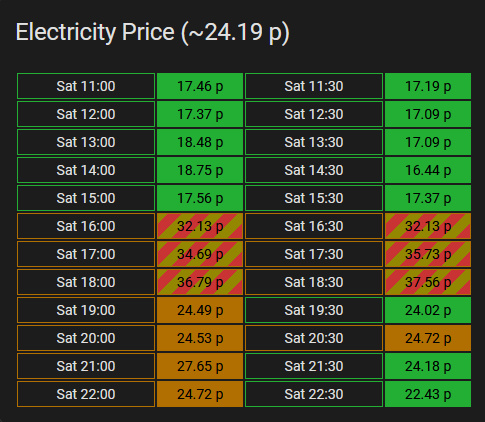

# Lovelace custom card for Octopus Energy Rate display

[](https://github.com/hacs/integration)

This lovelace card displays the Octopus Energy rate prices per each 30 minute slot, pulling the data from sensors of the the excellent [BottlecapDave/HomeAssistant-OctopusEnergy](https://github.com/BottlecapDave/) integration.

This is a slight modification on [lozzd/octopus-energy-rates-card](https://github.com/lozzd/octopus-energy-rates-card) where colors are choosen by being below/above the mean rate rather than a arbritrary number.
Also will be with a red gradient if it's above the `mediumlimit` configuration

This provides a convenient, at a glance way to observe the prices on tariffs that change their price every 30 minutes, for example Octopus Agile.

#### Installation
##### HACS
The easiest way to install it is via [HACS (Home Assistant Community Store)](https://github.com/hacs/frontend). This will ensure you get updates automatically too. 

Simply click this button to go directly to the details page:

[](https://my.home-assistant.io/redirect/hacs_repository/?owner=lozzd&repository=octopus-energy-rates-card&category=plugin)

In the Home Assistant UI:
* Use HACS -> Frontend -> Top Right Menu -> Custom repositories
* Enter a repo of `CharlesVu/octopus-energy-rates-card` and category of "Lovelace", and click the Add button
* Click "Explore & Download Repositories" and start searching for "octo" and you should see the entry
* Click "Download" in the bottom right

This should automatically configure all the resources, so you can now skip to **Configuration**.

##### Manually
You can also install manually by downloading/copying the Javascript file in to `$homeassistant_config_dir/www/community/` and then add the Javascript file to Lovelace in the Home Assistant UI by using
Settings -> Dashboards -> Top Right Menu -> Resources

#### Configuration
Add the card to your dashboard using **Add Card -> Custom: Octopus Energy Rates Card**.

You'll need to then configure the yaml yourself - the `type` part is filled out for you. 


The only **required** key is the name of the entity sensor that contains the rates. At least one of the "current", "previous" or "next" day rate entities will need to be selected. 

As of version 9.0.0 of the Octopus Energy integration, these entities are now called `events` and not enabled by default. In the Octopus Integration settings, filter by disabled entities and then search for the last section (e.g. `current_day_rates`) then press the button to enable the entity. It may take up to an hour for the data to be present, so don't panic if the card doesn't work immediately.

The easiest way to find that entity name is by opening the Search within Home Assistant: search for `current_rate` -> click the chosen result -> choose the Settings tab -> copy `Entity ID`.

(The format is, for example: `event.octopus_energy_electricity_{METER_SERIAL_NUMBER}}_{{MPAN_NUMBER}}_current_day_rates`)

Here's an example yaml configuration - obviously replacing `<your_id_here>` with your data from above. 

```
currentEntity: event.octopus_energy_electricity_<your_id_here>_current_day_rates
futureEntity: event.octopus_energy_electricity_<your_id_here>_next_day_rates
type: custom:octopus-energy-rates-card
cols: 2
```

Here's a breakdown of all the available configuration items:

| Name          | Optional | Default       | Description                                                                                                                                          |
|---------------|----------|---------------|:-----------------------------------------------------------------------------------------------------------------------------------------------------|
| currentEntity | N        | N/A           | Name of the sensor that contains the current rates you want to render, generated from the `HomeAssistant-OctopusEnergy` integration                  |
| futureEntity  | Y        | N/A           | Name of the sensor that contains the future rates you want to render, generated from the `HomeAssistant-OctopusEnergy` integration                   |
| cols          | Y        | 1             | How many columns to break the rates in to, pick the one that fits best with how wide your card is                                                    |
| showpast      | Y        | false         | Show the rates that have already happened today. Provides a simpler card when there are two days of dates to show                                    |
| title         | Y        | "Agile Rates" | The title of the card in the dashboard                                                                                                               |
| mediumlimit   | Y        | 20 (pence)    | If the price is above `mediumlimit`, the row is marked with a gradient                                                                               |
| roundUnits    | Y        | 2             | Controls how many decimal places to round the rates to                                                                                               |
| unitstr       | Y        | "p/kWh"       | The unit to show after the rate in the table. Set to an empty string for none.                                                                       |
| hour12        | Y        | true          | Show the times in 12 hour format if `true`, and 24 hour format if `false`                                                                            |
| multiplier    | Y        | 100           | multiple rate values for pence (100) or pounds (1)                                                                                                   |

#### A note on colouring

* The card is hardcoded to display plunge pricing (e.g, below 0p/kWh) as green. 
* If the price is above `mean_rate`, then the row is in orange
* Otherwise, the row is coloured with the theme primaryy color. 
* If the price is above `mediumlimit`, then the row is will have a red gradient

#### Screenshot


#### Thanks/inspiration
This card was based on and reworked from the code [markgdev/home-assistant_OctopusAgile](https://github.com/markgdev/home-assistant_OctopusAgile/tree/master/custom_cards) which is no longer maintained. 
Thanks [lozzd/octopus-energy-rates-card](https://github.com/lozzd/octopus-energy-rates-card) for the base code.
